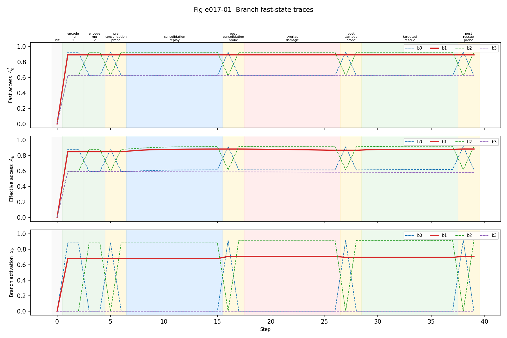
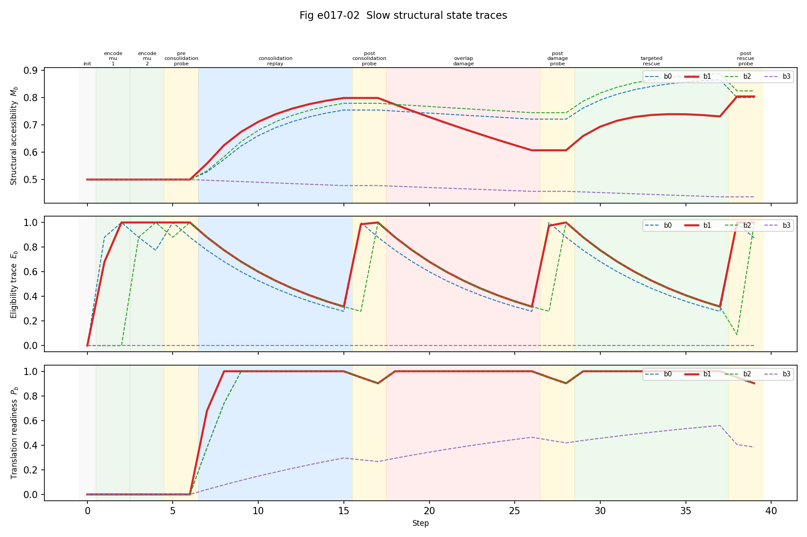
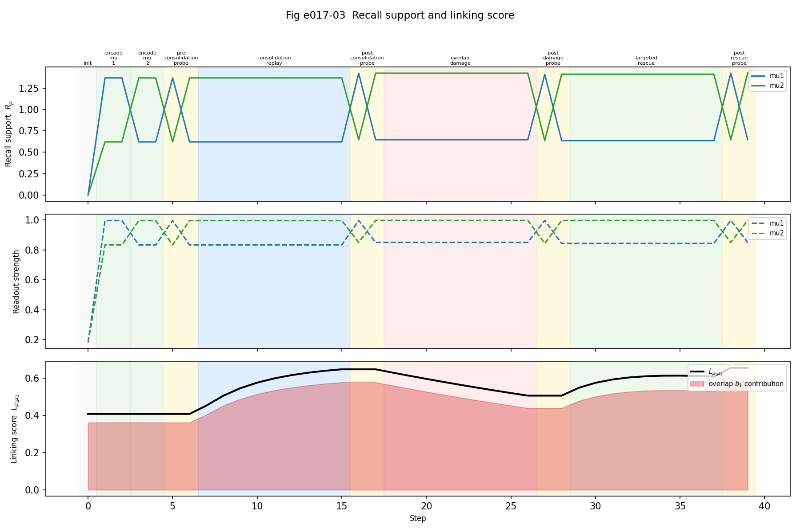
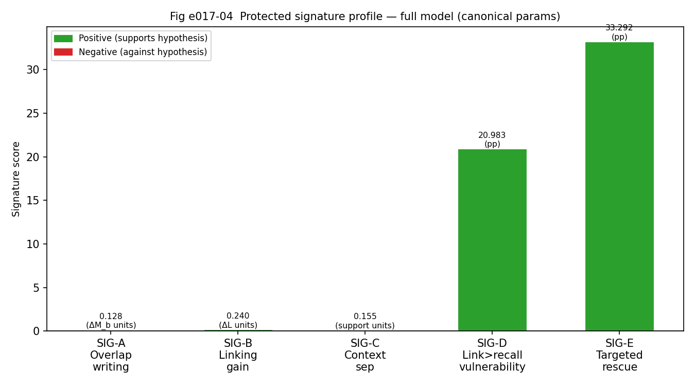

# 002 — 2026-06-22 — e017 Traceable Simulator Core: completed

## Session goal

Implementera `exp017_traceable_simulator_core.py` enligt spec i
`project/science_lead/001_simulator.md`.

---

## Vad som gjordes

### Läst in

- `experiments/exp001_minimal_branch_linking.py` — baseline canonical run, exp001-parametrar
- `experiments/exp015_comparator_baselines.py` — alla fem signaturer, canonical BASE_PARAMS

Viktiga observationer:
- exp001 och exp015 använder **olika parametrar** (exp001: `structural_lr=0.20`,
  exp015: `structural_lr=0.18`). e017 använder exp015/exp013-parametrarna (canonical).
- exp015 har redan alla fem signatur-funktioner implementerade. e017 wrappar dem
  i ett sammanhängande trace-export-script.

### Implementerat

**`experiments/exp017_traceable_simulator_core.py`** (~480 rader)

Innehåll:
- `run_canonical()` — 10-fas protokoll med per-step export av alla variabler
- `_run_sig_c()` — separat context-probe sim (inte en del av main trace-export)
- `_make_figures()` — 4 matplotlib-figurer
- `_write_docs()` — README, qc_report, effect_summary, claim_ledger, figure_manifest
- `_write_metadata()` — JSON med params, branch allocations, signaturer, SHA256-hashsummor

**`tests/test_e017_traceable_simulator_core.py`** (17 tester)

Täcker:
- column schema (branch, support, linking)
- alla 10 faser finns
- fasordning monoton
- branch-ID-identitet korrekt
- linking-score reberläknas konsistent från branch_traces
- inga NaN i kärn-kolumner
- SIG-A numerisk konsistens mot trace-data
- SIG-A–E alla positiva
- deterministisk körning (identiska signaturer vid upprepning)

---

## Resultat

### Körning

```
[e017] Wrote 160 branch rows, 80 support rows, 40 linking rows.
[e017] Figures saved.
[e017] Documentation written.
[e017] Metadata written.
```

### Signaturer

| Signatur | Värde | Riktning |
|----------|-------|----------|
| SIG-A overlap advantage     | +0.1281 ΔM_b | PASS |
| SIG-B linking gain          | +0.2397 ΔL   | PASS |
| SIG-C context separation    | +0.1545 support | PASS |
| SIG-D link>recall dissoc.   | +20.98 pp    | PASS |
| SIG-E targeted rescue adv.  | +33.29 pp    | PASS |

Alla fem positiva. Joint pass under direktionalitets-kriterium.

### Tester

```
17 passed in 1.54s
```

### Figurer






---

## Vad figurerna visar

**Fig 1 (fast state):** b1 (overlap, röd/solid) håller konsekvent högt `fast_access`
och `effective_access` under konsolidering och bibehåller aktivering vid probes.
b3 (irrelevant) förblir låg.

**Fig 2 (slow state):** b1 stiger tydligast i `M_b` under `consolidation_replay`.
Under `overlap_damage` sjunker b1 tillbaka. `E_b` är spetsformade runt encoding/probes.
`P_b` stiger snabbt vid konsolidering och faller sedan.

**Fig 3 (recall/linking):** `L_mu1_mu2` stiger stabilt under konsolidering, med
b1-bidraget (röd yta) som den dominerande drivkraften. Linking sjunker vid damage
och återhämtar sig delvis vid rescue.

**Fig 4 (signaturer):** Alla fem gröna. SIG-D och SIG-E dominerar numeriskt (pp-skala);
SIG-A–C är mindre men positiva.

---

## Kända begränsningar i e017

1. **SIG-C inte i main trace-export** — context-proben körs i separat sim.
   Traces för context-fasen finns inte i `branch_traces.csv`.
2. **`context_value` saknas** — exporteras inte per branch i nuvarande `BranchState`.
   Dokumenterat i `qc_report.md`.
3. **Canonical params only** — ingen parameter sweep ännu; robusthet är okänd.
4. **SIG-D magnitude** — +20.98 pp är substantiellt men robusthetsgränserna är okända.
5. **SIG-E magnitude** — +33.29 pp är stort; exakt sensititivitet mot rescue-protokollet okänd.
6. **4 grenar** — skalningsbeteende bortom canonical setup okänt.

---

## Claim ledger (uppdatering)

| Claim | Status | Evidens | Begränsning | Nästa åtgärd |
|-------|--------|---------|-------------|--------------|
| Simulator emiterar reproducerbara traces | **Internal validated result** | branch_traces.csv, 17 tester, run_metadata.json | Canonical params only | e018 |
| SIG-A overlap-branch writing | **Internal validated result** | +0.1281 ΔM_b; test_sig_a_is_positive PASS | Canonical params; ej robusthet | e018 comparator |
| SIG-B linking gain | **Internal validated result** | +0.2397 ΔL; test_sig_b_is_positive PASS | Canonical params | e018 |
| SIG-C context separation | **Internal validated result** | +0.1545; test_sig_c_is_positive PASS | Separat sim; ej i main traces | e018 |
| SIG-D linking>recall | **Internal validated result** | +20.98 pp; test_sig_d_is_positive PASS | Damage = decay-rate ökning | e018 |
| SIG-E targeted rescue | **Internal validated result** | +33.29 pp; test_sig_e_is_positive PASS | Ej generic rescue-comparator | e018 |
| Simulator separerar slow writing från fast gating | **Pending** | Kräver e018 comparator matrix | — | e018 |
| Joint signature kräver slow structural writing | **Pending** | Kräver e018 | — | e018 |

---

## Filer berörda

Nya:
- `experiments/exp017_traceable_simulator_core.py`
- `tests/test_e017_traceable_simulator_core.py`
- `results/e017_traceable_simulator_core/` (full katalogstruktur)

Oförändrade:
- `experiments/exp001_minimal_branch_linking.py`
- `experiments/exp015_comparator_baselines.py`
- `src/cytodend_accessmodel/simulator.py`
- `src/cytodend_accessmodel/contracts.py`

---

## Nästa rekommenderade steg

**e018 — Comparator Trace Matrix**

Kör samma trace-export och SIG-A–E-beräkning över alla fem comparator baselines
(plus ev. Hebbian-only, soma-gain-only, shuffled-replay):

```
full_model
fast_context_only
replay_no_structure
random_slow_drift
fixed_allocation_only
```

Producera en joint signature matrix som visar vilka baselines som kan reproducera
hela profilen (SIG-A–E). Det är det centrala svaret på eLifes kritik om
"simpler comparator baselines" och det som gör simulatorn till ett
model-discrimination-instrument.

Starta **inte** e018 förrän e017-traces är stabila och inspetkerbara —
det är de nu.
